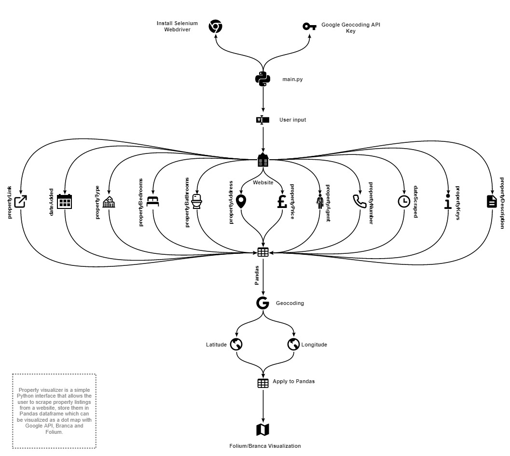

# Residential Property Visualization

UK housing market has hit a new record high of £254,822 in December 2021 which is an increase of 10.4% over the year and a largest annual increase since 2006.

<code>Property visualizer</code> is a simple Python interface that allows the user to scrape property listings from a website, store them in Pandas dataframe which can be visualized as a dot map with Google API, Branca and Folium.

## How it works

## How to use

1) Install <a href="https://chromedriver.chromium.org/getting-started">selenium webdriver for chrome</a> and place it in C:\Development\chromedriver.exe

2) To enable visualization feature, Google Geolocate API key will be required. Please provide a key in <code>geolocate.py</code>

3) Run <code>main.py</code> and select if you want detailed (includes no. bathrooms, bedrooms, keys, descriptions) or quick run.

4) After the inital setup, a browser will open where you can search for any listings you want. (Please note, currently visualization feature only works with "For Sale" properties)

4) When the search is complete, the csv (and html file if visualization was requested) will be saved on your computer.
